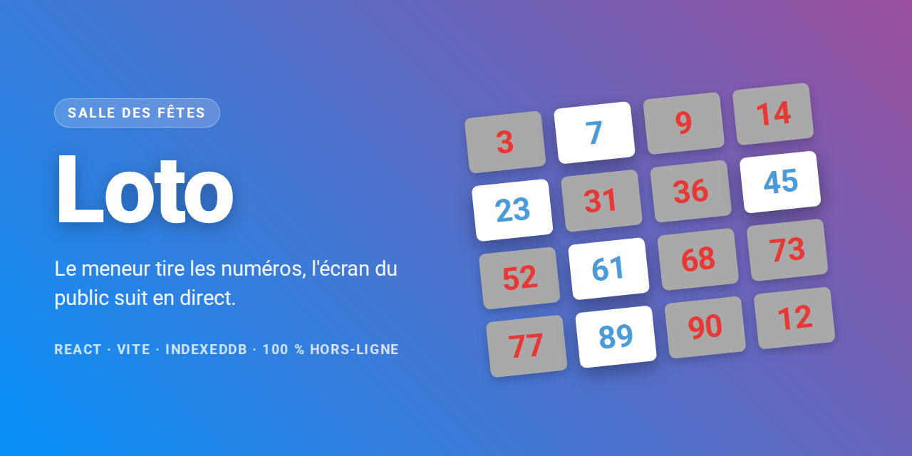
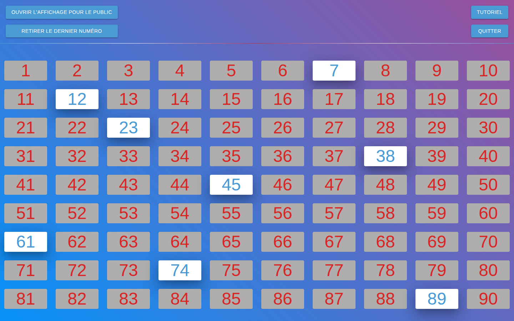
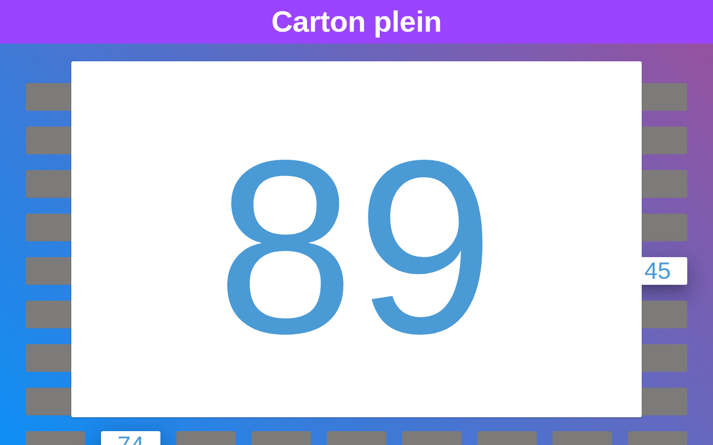

# Loto



Application de tirage de loto pour une salle des fêtes. Le meneur tire les numéros sur son
écran, le public les voit apparaître en grand sur un second écran, en direct.

Tout tourne dans le navigateur : **aucun serveur, aucun compte, aucune connexion**. Les
parties sont stockées en IndexedDB sur le poste du meneur.

---

## Aperçu

### 1. Ouvrir une partie

On donne un nom à la partie — ou on prend l'un des trois types proposés (une ligne, deux
lignes, carton plein), qui sert de titre sur l'écran du public.


### 2. Tirer les numéros

La grille des 90 numéros. Un clic sort un numéro, qui passe en blanc. Le bouton
**Retirer le dernier numéro** annule le tirage précédent en cas de fausse manœuvre.



### 3. L'écran du public

**Ouvrir l'affichage pour le public** ouvre la seconde vue, à envoyer sur le vidéoprojecteur
ou la télé de la salle. Le dernier numéro sorti s'affiche en très grand, les précédents
restent visibles autour.



---

## Comment les deux écrans se parlent

Il n'y a ni websocket ni backend. La fenêtre du meneur écrit la partie dans `localStorage`,
la fenêtre publique écoute l'évènement `storage` du navigateur et se redessine :

```
ManagementLoto  ──(localStorage "party")──▶  évènement storage  ──▶  NumbersViewer
      │
      └──(Dexie)──▶ IndexedDB « loto »
```

Conséquence pratique : **les deux écrans doivent être deux fenêtres du même navigateur, sur
la même machine**. Ce n'est pas un affichage déporté sur un autre poste.

---

## Stack

| | |
|---|---|
| Base | React 18 + TypeScript, build [Vite 6](https://vite.dev) |
| UI | MUI 5, Emotion, styled-components |
| Données | [Dexie](https://dexie.org) sur IndexedDB (base `loto`) |
| Routage | React Router 7 |
| Qualité | ESLint (flat config), Prettier, Vitest |

---

## Démarrer

```bash
npm install
npm run dev
```

Le serveur de développement écoute sur **https://localhost:3000** (certificat auto-signé :
le navigateur demande une confirmation au premier lancement).

### Scripts

| Commande | Effet |
|---|---|
| `npm run dev` | serveur de développement |
| `npm run build` | vérification TypeScript puis build de production dans `dist/` |
| `npm run build:dev` | idem, avec les variables de `.env.develop` |
| `npm run preview` | sert le build de production en local |
| `npm run lint` / `lint:fix` | ESLint |
| `npm run format` / `format:write` | Prettier |
| `npm test` / `test:watch` | Vitest |

---

## Structure

```
src/
├─ page/           ManagementLoto (meneur), NumbersViewer (public), ErrorPage
├─ component/      LotoNumber (une case de la grille), numbersViewer/
├─ forms/          AddParty (création de partie)
├─ request/        accès Dexie : Add, Get, GetParty, GetWhere, Update, Delete
├─ _types/         Party, Params, LotoNumbers (les 90 numéros et leur nom en toutes lettres)
├─ _styles/        thème et styles partagés
├─ config/         env.config.ts — seul point de lecture des variables d'environnement
└─ animation/      confetti.tsx (three.js)
```

### Variables d'environnement

Les fichiers `.env.development`, `.env.develop` et `.env.production` sont à la racine, au
format Vite (préfixe `VITE_`). Une seule variable est réellement lue, `VITE_BASE_URL`, qui
sert à construire l'URL de l'écran public.

---

## Déploiement

`npm run build` produit un site statique dans `dist/`, déployable tel quel sur n'importe quel
hébergement.

Deux points à ne pas oublier :

- L'application a deux routes (`/` et `/numbers`) gérées côté client. Le serveur doit
  renvoyer `index.html` sur les URL inconnues. Le `.htaccess` fourni à la racine du dépôt
  fait ça pour Apache — **il n'est pas copié dans `dist/`** par le build, il doit donc déjà
  être présent sur l'hébergement.
- Les fichiers du build sont nommés par hash : envoyer le contenu de `dist/` suffit.

---

## Limites connues

- **`VITE_BASE_URL` de production est faux** : il pointe vers une API sans rapport avec ce
  projet. En production, le bouton « Ouvrir l'affichage pour le public » ouvre donc une
  mauvaise URL. À corriger avec le domaine réel du loto.
- **`src/animation/confetti.tsx` est du code mort** : les appels sont commentés dans
  `ManagementLoto`. La dépendance `three` (et `@types/three`) n'existe que pour ce fichier.
- **Aucun test** n'est écrit, bien que Vitest soit configuré.
- Le champ `viewType` créé en base (`outPutNumber`) n'est lu nulle part.

---

## Licence

[PolyForm Noncommercial 1.0.0](LICENSE.md) — usage, modification et redistribution libres
**pour tout usage non commercial**. Une association qui s'en sert pour animer ses soirées
est dans son droit ; la revendre, l'exploiter comme service payant ou l'intégrer à une offre
commerciale demande une autorisation écrite.

GitHub ne reconnaît pas cette licence dans son détecteur automatique : elle n'apparaîtra pas
dans le bandeau du dépôt, seul le fichier `LICENSE.md` fait foi.
